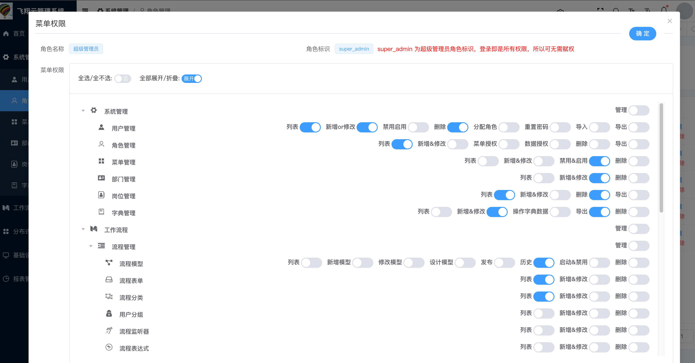
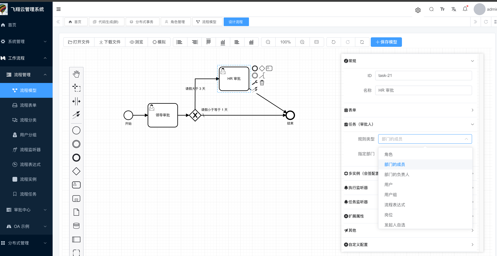
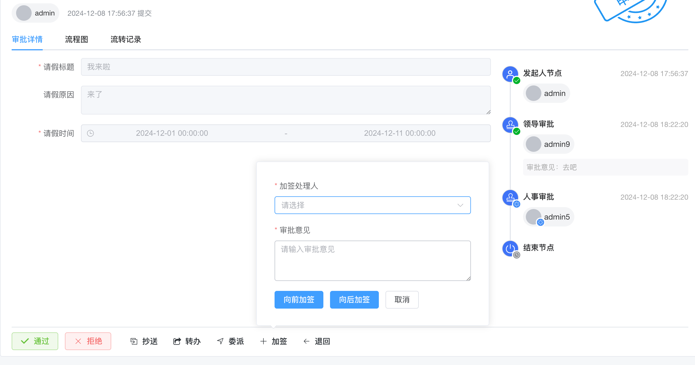
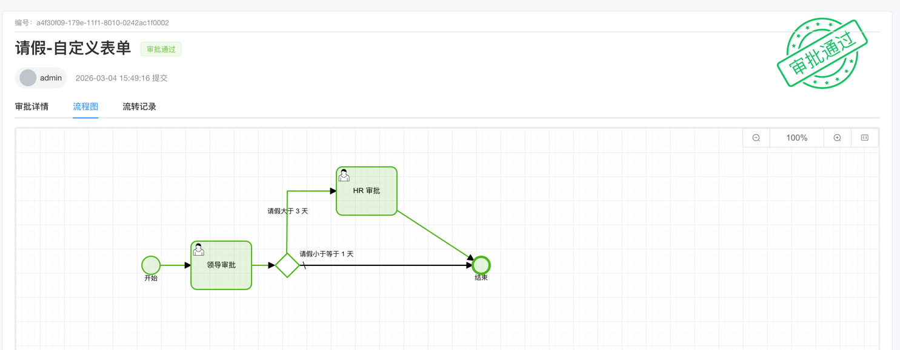
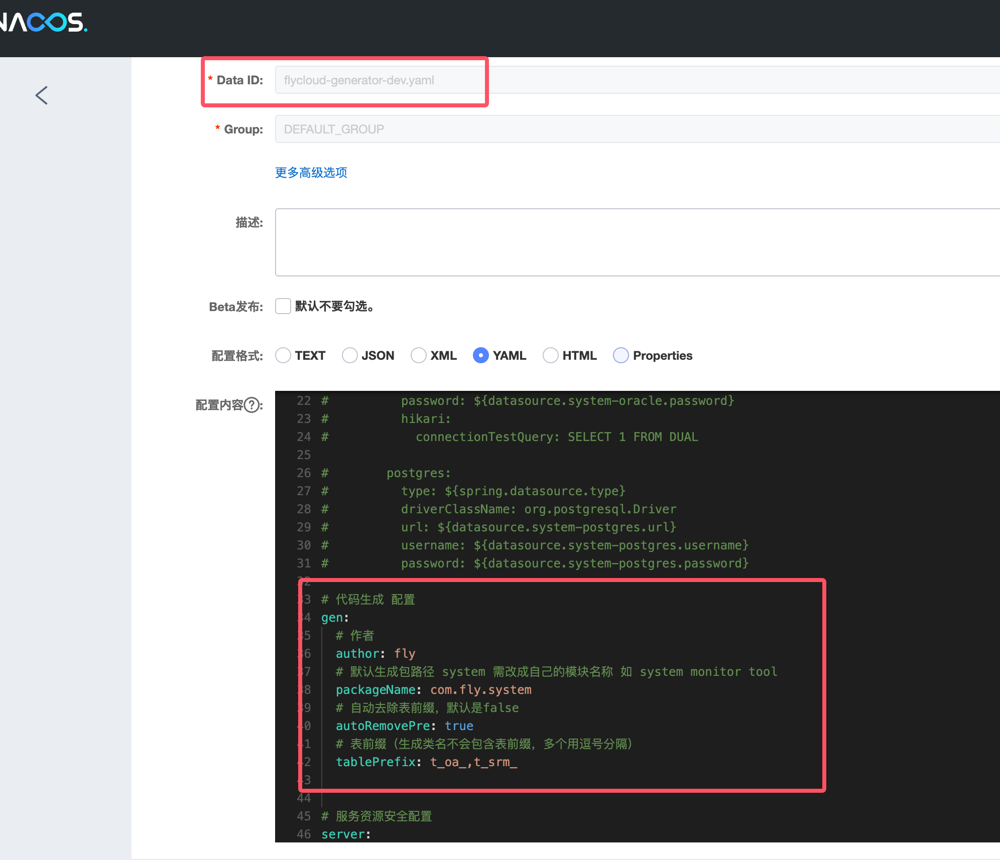
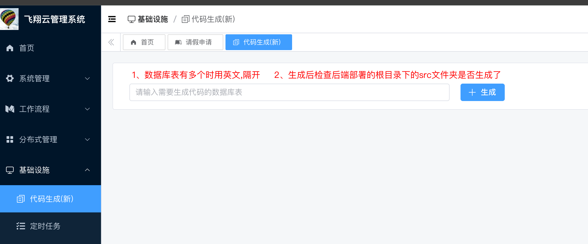
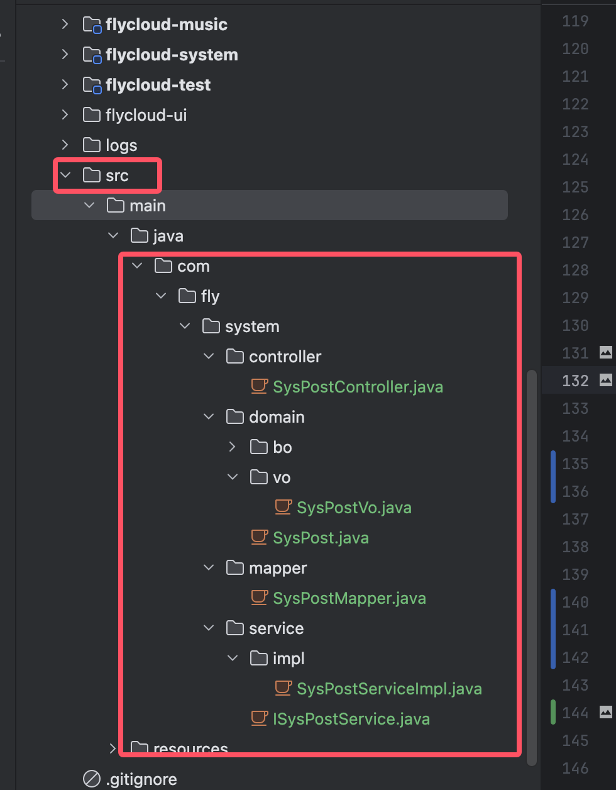
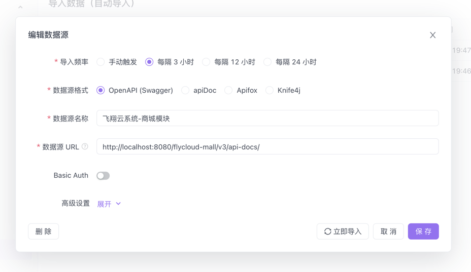

### 1、项目说明:
- flycloud 是一款基于Spring Cloud Alibaba的微服务架构。
- 目前整合了 JDK 21、Spring Boot 3.5.3、Spring Cloud 2025.0.3、Spring Cloud Alibaba 2025.0.0.0、Nacos 3.0.3、Mysql 8.4、Spring Security、Flowable 6.8.0 + bpmn.js、ElasticSearch、MyBatis Plus、Seata、Redis、Rabbitmq 等主流技术。
- 主要以系统后台功能项目为主，扩展项目为辅的一个飞翔云系统。
- 开发情况：系统后台开发完毕，拓展业务陆续开发中...


### 2、地址
### 👉 演示地址：http://www.laixueshi.cn  （飞翔云平台系统）
| 账号        | 密码          |
|-----------|-------------|
| admin     | admin123    |
| fileadmin | admin123456 |


### 👉 项目地址：
| 后端                                        | 前端                                                                                |
|-------------------------------------------|-----------------------------------------------------------------------------------|
| https://github.com/15521142480/flycloud   | https://github.com/15521142480/flycloud/tree/master/flycloud-ui 即后端的flycloud-ui模块 |

### 分支说明：

| 分支              | 说明                                           | jdk   | vue                  |
|-----------------|----------------------------------------------|-------|----------------------|
| main            | 主分支                                          | jdk21 | vue3                 |
| dev/main        | 开发分支                                         | jdk21 | vue3                 |
| jdk8            | jdk8归档分支                                     | jdk8  | vue2 + vue3          |   
| jdk8_two_server | 两个服务特殊分支版本（即auth服务集成用户服务），启动2个服务即可操作，针对低配置用户 | jdk8  | vue2 + vue3          |
- 推荐使用main分支，最新技术框架版本
- 其次jdk8分支，已稳定运行和归档

### 3、系统集成了:

| 后端           | 框架                                                    |
|--------------|-------------------------------------------------------|
| jdk          | jdk21                                                 |
| 核心框架         | Spring Boot 3.5.3                                     |
| 微服务          | Spring cloud 2025.0.3、Spring cloud Alibaba 2025.0.0.0 |
| 注册和配置中心      | Nacos 3.0.3                                           |
| 安全/授权框架      | Spring Security + jwt                                 |
| 工作流框架        | Flowable 6.8.0  + bpmn.js                             |
| 数据库/持久层/自动生成 | Mysql8.4 + Mybatis plus、 Velocity                     |
| 分布式事务        | Seata                                                 |
| 缓存           | Ehcache、 Redis                                        |
| 搜索引擎         | ElasticSearch (待续)                                    |
| 消息队列框架       | RocketMQ (待续)                                         |
| 文档框架         | SpringDoc + Swagger                                   |
| 日志框架框架       | Logback                                               |


| 前端   | 框架                                 |
|------|------------------------------------|
| 项目框架 | vue3                               |
| ui框架 | Element-ui、Element-plus、iview、vant |


### 4、框架目录结构:
```
flycloud
├─db       -- 系统sql
├─doc      -- 系统文档
├─flycloud-api              -- 内网接口（实体和feign等api层）
│  ├─flycloud_bpm_api                   -- 工作流api
│  ├─flycloud_system_api                -- 系统api
├─flycloud-auth             -- 授权服务
├─flycloud-bpm              -- 工作流服务
├─flycloud-common           -- 公共模块
│  ├─flycloud-common-core               -- 公共模块核心代码
│  ├─flycloud-common-database           -- 数据库连接相关
│  └─flycloud-common-doc                -- springdoc(swagger)相关
│  └─[flycloud-common-elasticsearch     -- es相关
│  └─flycloud-common-feign              -- feign相关
│  └─flycloud-common-redis              -- redis相关
│  └─flycloud-common-seata              -- seata(分布式事务)相关
│  └─flycloud-common-security           -- 安全相关
│  ├─flycloud-common-rocketmq           -- rocketmq相关
├─flycloud-extend           -- 扩展模块 (如 xxl-job-admin、springboot-admin等)
│  ├─flycloud-file-admin                -- 文件管理后台服务
│  ├─flycloud-xxl-job-admin             -- 任务调度服务
├─flycloud-gateway          -- 网关服务
├─flycloud-generator        -- 自动生成代码服务
└─flycloud-mall             -- 商家服务
└─flycloud-system           -- 平台服务
└─flycloud-test             -- 测试服务 (测试各种服务代码或中间件)
└─flycloud-ui               -- 系统的ui前端模块
│  ├─flycloud-admin-ui                  -- 平台管理后台ui 
└─logs     -- 系统日志 
```


### 5、后端服务:
| 服务                                | 地址                    |
|-----------------------------------|-----------------------|
| 优先启动（必须）:                         |
| flycloud-gateway     网关服务         | http://127.0.0.1:8080 |
| flycloud-auth        授权校验服务       | http://127.0.0.1:8088 |
| flycloud-system      系统服务         | http://127.0.0.1:8085 |
| 系统业务服务:                           |
| flycloud-bpm         工作流服务        | http://127.0.0.1:8090 |
| flycloud-mall        商城服务         | http://127.0.0.1:8081 |
| 其他服务:                             |
| flycloud-generator   自动生成代码服务     | http://127.0.0.1:8089 |
| flycloud-test        测试服务         | http://127.0.0.1:8099 |
| 扩展服务:                             |
| flycloud-file-admin   文件管理后台      | http://127.0.0.1:9095 |
| flycloud-xxl-job-admin     任务调度服务 | http://127.0.0.1:9091 |


### 6、前端服务:（可选）
| 服务                                        | 地址                    |
|-------------------------------------------|-----------------------|
| flycloud-admin-ui            平台ui (新)     | http://127.0.0.1:7075 |


### 7、系统功能:
| 功能        | 描述                                         |
|-----------|--------------------------------------------|
| 首页        | 统计当前用户整个业务报表统计、OA流程的代办事项、通知等               |
| 用户管理      | 主要对系统操作的用户进行配置                             |
| 角色管理      | 对角色进行菜单权限、数据权限的分配；其中菜单权限采用自研的新型设计思路来实现权限的可视化 |
| 菜单管理      | 对系统菜单权限、页面按钮权限等标识，以及对菜单的动态配置，如路由、位置、icon等  |
| 部门管理      | 配置系统组织机构，树结构展现支持数据权限                       |
| 岗位管理      | 配置用户所属担任职务                        |



### 8、工作流程
>   采用flowable + bpmn.js 支撑整个系统的工作流引擎

| 功能    | 描述                                                                                                                |
|-------|-------------------------------------------------------------------------------------------------------------------|
| 流程管理  |                                                                                                                   |
| 流程模型  | 配置流程模型，可进行设计、修改和发布；页面端采用bpmn.io技术方案实现可视化拖拽设计工作流程文件，富含构建工作流的整个功能，如：事件/审批节点、条件网关、打开/下载文件、预览流程图等；流程表单可配置两种：业务表单、动态表单 |
| 流程表单  | 配置动态表单，拖拽式和丰富的组件和在线预览，以及支持PC、ipad、移动端                                                                             |
| 流程分类  | 将流程进行分类，如OA办公流程、文件审批流程、采购审批流程、订单下单流程等                                                                             |
| 用户分组  | 归纳用户的分类，以便后续的自定义审批范围                                                                                              |
| 流程监听器 | 开发的重点，配置了流程监听器才能真正意义上的走完全流程，如流程开始需要发信息、流程中途需要做统计、流程结束要监听改变该流程变量为结束状态等                                             |
| 流程表达式 | 配置流程表达式                                                                                                           |
| 流程实例  | 一般是超级管理员的专属功能，可查看所有已经启动的流程信息，如流程状态、流程表单、审批信息等                                                                     |
| 流程任务  | 一般是超级管理员的专属功能，可查看所有流程审批的操作，如谁谁谁同意的哪个流程、拒绝了哪个流程等                                                                   |
| 审批中心  |                                                                                                                   |
| 发起流程  | 用户可发起流程申请，该流程的发起人就是当前用户，比如发起请假流程审批                                                                                |
| 我的流程  | 可查看我发起的、有关我审批的流程信息                                                                                                |
| 待办任务  | 重点功能，就是这个流程轮到你处理了，也可在首页的待办事项处理                                                                                    |
| 已办任务  | 你处理过的任务，可查看其流程信息                                                                                                  |
| 抄送我的  | 抄送给你的流程表单信息，也可查看其流程信息                                                                                             |
| OA示例  |                                                                                                                   |
| 请假申请  | 普通业务表单页面发起流程的示例，也就是可以从业务表单提交后的动作即可启动流程，类似的还有公司公告发布、新建合同、订单下单、采购申请等页面                                              |

### 流程引擎功能
| 功能列表       | 功能描述                                                                                | 是否完成 |
|------------|-------------------------------------------------------------------------------------|------|
| BPMN 设计器   | 基于 BPMN 标准开发，适配复杂业务场景，满足多层级审批及流程自动化需求                                               | ✅    |
| 会签         | 同一个审批节点设置多个人（如 A、B、C 三人，三人会同时收到待办任务），需全部同意之后，审批才可到下一审批节点                            | ✅    |
| 或签         | 同一个审批节点设置多个人，任意一个人处理后，就能进入下一个节点                                                     | ✅    |
| 依次审批       | （顺序会签）同一个审批节点设置多个人（如 A、B、C 三人），三人按顺序依次收到待办，即 A 先审批，A 提交后 B 才能审批，需全部同意之后，审批才可到下一审批节点 | ✅    |
| 抄送         | 将审批结果通知给抄送人，同一个审批默认排重，不重复抄送给同一人                                                     | ✅    |
| 驳回         | （退回）将审批重置发送给某节点，重新审批。可驳回至发起人、上一节点、任意节点                                              | ✅    |
| 转办         | A 转给其 B 审批，B 审批后，进入下一节点                                                             | ✅    |
| 委派         | A 转给其 B 审批，B 审批后，转给 A，A 继续审批后进入下一节点                                                 | ✅    |
| 加签         | 允许当前审批人根据需要，自行增加当前节点的审批人，支持向前、向后加签                                                  | ✅    |
| 减签         | （取消加签）在当前审批人操作之前，减少审批人                                                              | ✅    |
| 撤销         | （取消流程）流程发起人，可以对流程进行撤销处理                                                             | ✅    |
| 终止         | 系统管理员，在任意节点终止流程实例                                                                   | ✅    |
| 表单权限       | 支持拖拉拽配置表单，每个审批节点可配置只读、编辑、隐藏权限                                                       | ✅    |
| 超时审批       | 配置超时审批时间，超时后自动触发审批通过、不通过、驳回等操作                                                      | ✅    |
| 自动提醒       | 配置提醒时间，到达时间后自动触发短信、邮箱、站内信等通知提醒，支持自定义重复提醒频次                                          | ✅    |
| 父子流程       | 主流程设置子流程节点，子流程节点会自动触发子流程。子流程结束后，主流程才会执行（继续往下下执行），支持同步子流程、异步子流程                      | ✅    |
| 条件分支       | （排它分支）用于在流程中实现决策，即根据条件选择一个分支执行                                                      | ✅    |
| 并行分支       | 允许将流程分成多条分支，不进行条件判断，所有分支都会执行                                                        | ✅    |

  
  
  

### 9、es索引引擎说明:
-   elasticsearch 版本为: 7.17.7
-   elasticsearch 客户端框架为: easy-es; 零成本上手(简单 易用 方便)


### 10、generator自动生成代码说明:
-   有两种生成方式两种:
-   第一种: 通过后台管理生成，生成后位置在后端部署的根目录下的src文件夹；
-   第二种: 直接访问接口生成: http://ip:网关端口/flycloud-generator/gen/generatorCode?tables=sys_user  (多个用,隔开; 默认生成的文件在当前根目录下, 具体看生成时的控制台日志信息)





### 11、Swagger文档说明:
-  本系统使用的是 Spring doc
-  由于框架采用openapi行业规范，如需使用第三方文档工具 如 apifox, 则数据源的url是: `域名+网关端口+/服务名/v3/api-docs/`, 如: http://localhost:8080/flycloud-system/v3/api-docs/



### 12、实体模型(domain)说明:
>   BO -> 由于此系统采用的分布式微服务架构, 也就每个服务相对独立, 且都是服务之间的调用(网关), 所以DTO的概念换成了BO
>   <br> VO -> 客户端(页面)展示的数据, 通常以json存在的形式

