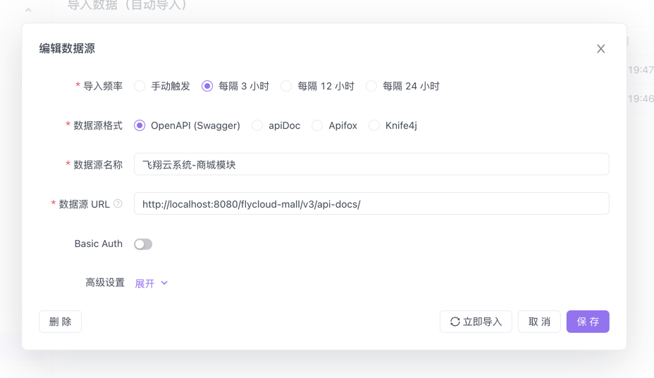

## Swagger文档

> 本系统使用的是 spring doc + swagger3.0 
  优点: 1. 由于Springfox 已停止维护, 且随着springboot升级bug众多; 且需要编写大量的注解来支持文档生成
       2. 支持spring boot, spring cloud, spring gateway, 等
       3. 最重要是支持 javadoc (java注释), 基于java注释可实现零入侵

> 使用方法1 (使用自带ui工具):
> 本系统文档的访问路径：`域名+网关端口+/swagger-ui.html`，如: http://localhost:8080/swagger-ui.html

> 使用方法2 (使用第三方工具):
> 由于框架采用openapi行业规范，如需使用第三方文档工具 如 apifox, 则数据源的url是: `域名+网关端口+/v3/api-docs/`, 如: http://localhost:8080/v3/api-docs/
> 

> 使用原理
>
> 待续...
> 

> 最后:
> pom文件确保启用therapi-runtime-javadoc的注释处理器，以便启用对springdoc-openapi的javadoc支持。
<build>
<plugins>
<plugin>
<groupId>org.apache.maven.plugins</groupId>
<artifactId>maven-compiler-plugin</artifactId>
<configuration>
<annotationProcessorPaths>
<path>
<groupId>com.github.therapi</groupId>
<artifactId>therapi-runtime-javadoc-scribe</artifactId>
<version>0.15.0</version>
</path>
</annotationProcessorPaths>
</configuration>
</plugin>
</plugins>
</build>
